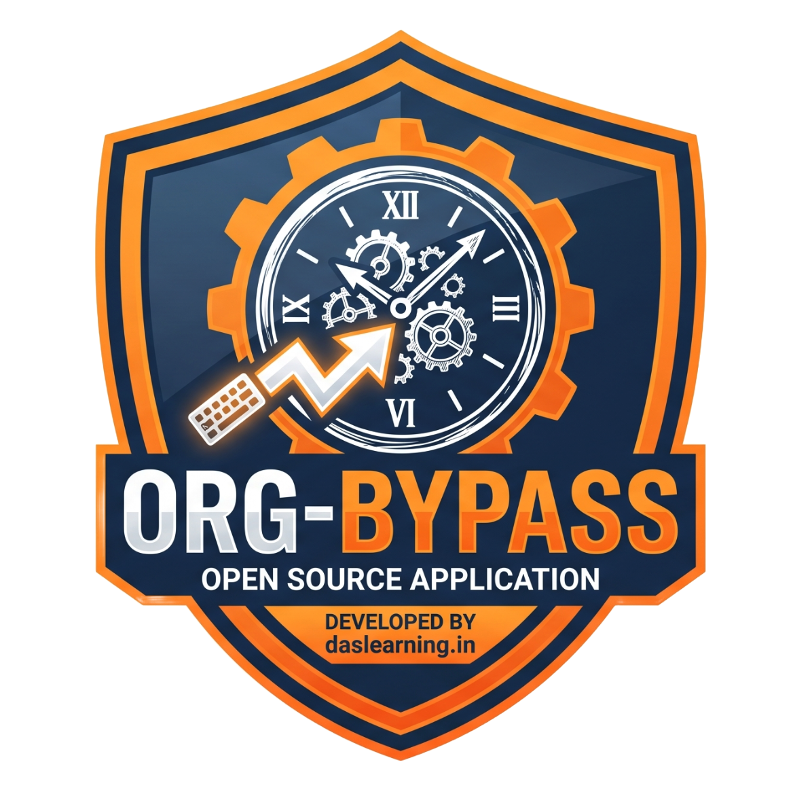

# 💼 Org-Bypass 🤫
An open-source initiative to bypass some of the unnecessary stupid restrictions or monitoring implementations on your work computer.

> Note: We do not encourage to do illegal things which might cause security voilations. Use this at your own risk!

## 🕥 Bypass Time Tracking
Your corporate device may track mouse movement or keyboard inputs to track active time. We have seen some bypasses using a rotating fan attached to a mouse etc.  

What if we could automatically send some keyboard inputs to the computer & we do not need to create any script or install any additional software? Yup, that's right, we will be leveraging simple usb keyboard technology with a tiny micro-controller.

### 📽️ Demo
You can click on the below Image or this [Youtube Link](https://www.youtube.com/watch?v=otWfiaH-So8) to see the demo. Please let me know in the comments, how do you feel about this App.  

### 🧑🏻‍💻 Automatic Coding Keyboard
This works a standard USB keyboard but with a magical twist. You can connect this to your wifi > then provide a public website link (typically github raw link of any code) > it writes the code on your behalf while you enjoy your free time.

#### 𓏠 Hardware requirement
1. [ESP32-S3-super-mini](https://amzn.in/d/0hTg92ZB) or [Standard ESP32-S3](https://amzn.in/d/0fae1Qvm) or any variant of ESP32-S3
2. A type-c USB cable or a micro-usb cable depending on your ESP model.

#### 🧩 Steps

##### Using web flasher (Recommended)

* Go to this [web flasher](https://mc.daslearning.in/esp32/coder-keyboard/) using any Chromium based browser like Chrome, Edge, Brave etc on you computer.  

* Connect your ESP32-S3 with a USB cable. If you don't see your serial device, you can press & hold `Boot` button on ESP32, then press the `Reset` button and release both. Try to connect again.

* After successful conenction, just press the `Flash` button from the web.

* Once flashing is successful you can remove the USB cable & use the automatic keyboard anywhere.

* If it is turned on & it is not configured to connect to any WiFi, it will be in `HotSpot mode` > then connect to the WiFi name `ESP32-AutoKB` from any device (password: 12345678) > type in `http://192.168.4.1` from your device to control the keyboard.

* You can simply turn on the automatic keyboard without the need to connect to any WiFi, it will act as a [simple-automatic-keyboard](#-sipmple-automatic-usb-keyboard).

* You can provide your WiFi credentials, once that is set, you can restart (unplug & plug) ESP32. It should connect to your WiFi.

* Grab the `IP` for the ESP32 (from router login or serial console) > type in `http://<your-ip>` in any browser from the same network > You will get a text box to input any public URL, you may enter anything.

* Start the Auto Mode & it will start typing the html/raw code of that website in your notepad / IDE.

##### Using Ardunio IDE (Manual)

* Install ESP32 on Arduino IDE. You can follow this simple [guide](https://randomnerdtutorials.com/installing-the-esp32-board-in-arduino-ide-windows-instructions/).

* Select your ESP32-S3 board in `Tools` > `Board`. Generally is should be `ESP32S3 Dev Module`.

* Copy our [auto-coder-keyboard](./auto-keyboard-input/autoKeyCoder/autoKeyCoder.ino) in your `Arduino IDE`.

* Press the upload button to push the code on ESP32.

* You need upload the [data-folder](./auto-keyboard-input/autoKeyCoder/data/) on ESP32.

* After a successful flashing, you can configure & use as per above steps mentioned after flashing in [web-flasher](#using-web-flasher-recommended).

### ⌨ Sipmple Automatic USB Keyboard
ESP32-S3 natively supports USB OTG and it is perfect for this project. It will act as a USB keyboard which can send automatic inputs from `a-z` every 3 seconds (configurable in code).

#### 𓏠 Hardware requirement
Same as [above](#𓏠-hardware-requirement)

#### 🧩 Steps

##### Using the web flasher (Easy)

* Go to this [web flasher](https://mc.daslearning.in/esp32/automatic-keyboard/) using any Chromium based browser like Chrome, Edge, Brave etc on you computer.  

* Connect your ESP32-S3 with a USB cable. If you don't see your serial device, you can press & hold `Boot` button on ESP32, then press the `Reset` button and release both. Try to connect again.

* After successful conenction, just press the `Flash` button from the web.

* Once flashing is successful you can remove the USB cable & use the automatic keyboard anywhere.

##### Using Arduni IDE (Manual)

* Install ESP32 on Arduino IDE. You can follow this simple [guide](https://randomnerdtutorials.com/installing-the-esp32-board-in-arduino-ide-windows-instructions/).

* Select your ESP32-S3 board in `Tools` > `Board`. Generally is should be `ESP32S3 Dev Module`.

* Copy our [auto-keyboard-code](./auto-keyboard-input/autoUsbKeyInpEsp32.ino) in your `Arduino IDE`.

* Simply press the `Upload` button and relax.

* After a successful flashing, it becomes your USB keyoard which sends automatic inputs.

## 💰 Sponsor Me
You can buy me a coffee via [this link](https://www.paypal.com/paypalme/soomnathsdas) or tap on below image. Thank you 🙏.  

